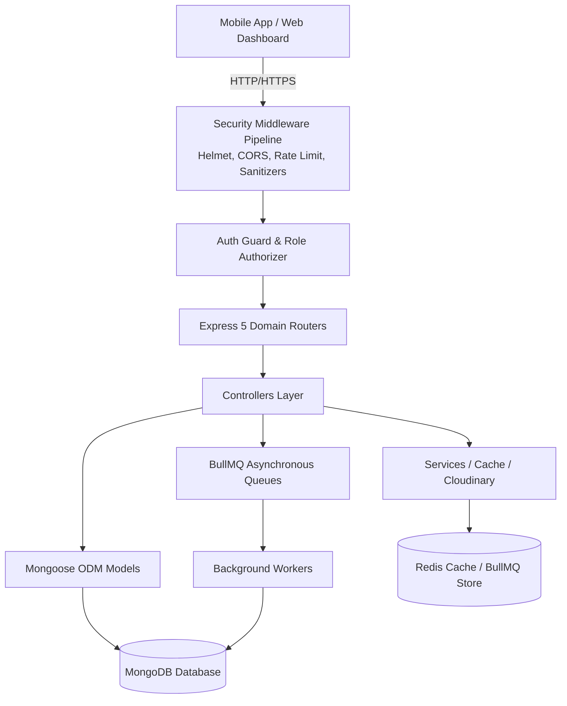
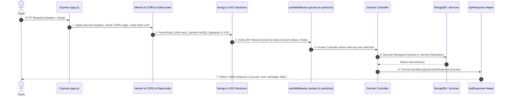

# 📘 JustRide Backend — Comprehensive Developer Guide & File Documentation

> **Target Audience**: New developers, contributors, and maintainers joining the JustRide Backend project.  
> **Purpose**: Provide an organized, end-to-end walkthrough of every single directory, file, design pattern, data flow, and step-by-step workflow required to build and deploy new features seamlessly.

---

## 📑 Table of Contents

1. [System Overview & Architecture](#1-system-overview--architecture)
2. [Folder Structure Directory Tree](#2-folder-structure-directory-tree)
3. [File-by-File Documentation](#3-file-by-file-documentation)
   - [Root Files](#31-root-files)
   - [src/config/](#32-srcconfig)
   - [src/middlewares/](#33-srcmiddlewares)
   - [src/security/](#34-srcsecurity)
   - [src/utils/](#35-srcutils)
   - [src/models/](#36-srcmodels)
   - [src/services/](#37-srcservices)
   - [src/queues/](#38-srcqueues)
   - [src/workers/](#39-srcworkers)
   - [src/routes/](#310-srcroutes)
   - [src/controllers/](#311-srccontrollers)
4. [Authentication, Roles & Session Architecture](#4-authentication-roles--session-architecture)
5. [Request Lifecycle & Security Middleware Pipeline](#5-request-lifecycle--security-middleware-pipeline)
6. [Background Jobs & Workers Architecture](#6-background-jobs--workers-architecture)
7. [Step-by-Step: How to Add a New Feature](#7-step-by-step-how-to-add-a-new-feature)
8. [Environment Variables Reference](#8-environment-variables-reference)
9. [Coding Conventions, Rules & Best Practices](#9-coding-conventions-rules--best-practices)

---

## 1. System Overview & Architecture

JustRide Backend is an enterprise-grade IoT fleet management, rider service, support ticketing, and OTA (Over-The-Air) firmware deployment engine built with **Node.js** and **Express 5.x**.

### Core Capabilities:
- **Rider Auth & Profile Management**: JWT dual-token (Access + Refresh rotation) system supporting OAuth (Google) and local auth.
- **BLE Hardware & Fleet Telemetry**: BLE device provisioning, live battery/RSSI telemetry ingestion, security locking, and rider-device binding.
- **OTA Firmware Management**: Firmware channel releases (Stable, Beta, Canary), binary uploads to Cloudinary/local disk, and rollout status tracking.
- **Support Ticketing System**: Multi-actor tickets for riders and customer care helpers, with diagnostics attachment.
- **Enterprise Staff Hierarchy**: Roles (`ADMIN`, `HELPER`, `USER`), staff performance tracking, and ticket assignments.
- **Security & Forensic Audit Logging**: Immutable audit trails, IP rate-limiting, MongoDB operator sanitization, and XSS filtering.
- **Asynchronous Background Processing**: BullMQ job queues backed by Redis with graceful fallback for notifications and audit persistence.



---

## 2. Folder Structure Directory Tree

```
c:\Hanumansai_Projects\Justride\Backend\
├── .env                          # Local environment secrets & connection strings
├── .gitignore                    # Git file exclusions
├── package.json                  # Project manifest, dependencies, scripts
├── server.js                     # HTTP Server entry point (DB connect, Workers init, Listen)
├── README.md                     # High-level overview & quickstart
├── DEVELOPER_GUIDE.md            # This comprehensive documentation file
└── src/
    ├── app.js                    # Express application setup, global middleware, route mounts
    ├── config/                   # Third-party services & database configuration
    │   ├── db.js                 # MongoDB Mongoose connection manager
    │   ├── redis.js              # Redis client setup & in-memory fallback
    │   ├── cloudinary.js         # Cloudinary SDK media uploader config
    │   └── seedAdmin.js          # Default superadmin seeding logic on startup
    ├── controllers/              # HTTP Request handlers (logic orchestration)
    │   ├── notification.controller.js  # Rider notifications controller
    │   ├── savedAddressController.js   # Rider saved places controller
    │   ├── support.controller.js       # Rider support ticketing controller
    │   ├── upload.controller.js        # File upload controller (Cloudinary/Disk)
    │   ├── userController.js           # Rider auth & profile controller
    │   ├── admin/                      # Admin & Staff portal operations
    │   │   ├── audit.controller.js         # Audit log querying & forensic analytics
    │   │   ├── auth.controller.js          # Admin/Staff login & employee provisioning
    │   │   ├── dashboard.controller.js     # Fleet KPIs, revenue, status stats
    │   │   ├── devices.controller.js       # Fleet inventory & device security actions
    │   │   ├── firmware.controller.js      # OTA release publishing & rollout stats
    │   │   ├── notification.controller.js  # Staff broadcast notification management
    │   │   ├── pairing.controller.js       # Admin pairing diagnostic controls
    │   │   ├── support.controller.js       # Staff support ticket assignment & replies
    │   │   └── users.controller.js         # Rider account state & history management
    │   └── device/                     # Device hardware & rider-facing endpoints
    │       ├── device.controller.js        # Telemetry ingestion & device state
    │       ├── firmware.controller.js      # OTA device checks & binary downloads
    │       └── pairing.controller.js       # BLE challenge-handshake pairing engine
    ├── middlewares/              # Express middlewares
    │   ├── authMiddleware.js     # JWT token verification & role authorization guards
    │   ├── errorHandler.js       # Centralized 500 error formatting middleware
    │   └── upload.middleware.js  # Multer memory/disk file storage middleware
    ├── models/                   # Mongoose Schemas & Model Definitions
    │   ├── index.js              # Centralized Model Registry export point
    │   ├── User.js               # Rider / Standard user schema
    │   ├── Helper.model.js       # Admin / Customer Care staff schema
    │   ├── device.model.js       # BLE IoT device hardware & telemetry schema
    │   ├── SupportTicket.model.js# Multi-actor customer support ticket schema
    │   ├── Saved_address.model.js# User saved locations schema
    │   ├── Notification.model.js # System / Push / In-app notification schema
    │   ├── FirmwareRelease.model.js # OTA firmware version releases schema
    │   ├── FirmwareHistory.model.js # Device-to-Firmware installation history
    │   └── AuditLog.model.js     # Immutable system security event audit logs
    ├── queues/                   # BullMQ Job queue producers
    │   ├── audit.queue.js        # Async audit log creation queue
    │   └── notification.queue.js # Asynchronous push/email notification queue
    ├── routes/                   # Express Router endpoints
    │   ├── adminRoutes.js        # Admin & staff management routes (/api/admin)
    │   ├── deviceRoutes.js       # IoT device & pairing routes (/api/devices)
    │   ├── notificationRoutes.js # User notifications routes (/api/notifications)
    │   ├── savedAddressRoutes.js # User addresses routes (/api/addresses)
    │   ├── supportRoutes.js      # Support tickets routes (/api/support)
    │   ├── uploadRoutes.js       # File upload routes (/api/upload)
    │   └── userRoutes.js         # User auth & profile routes (/api/users)
    ├── security/                 # Threat prevention, sanitizers, validation
    │   ├── auditLogger.js        # Audit logging helper utility
    │   ├── rateLimiter.js        # General, Auth, and Telemetry rate limiters
    │   ├── sanitize.js           # Mongo query injection & XSS sanitization
    │   ├── securityLogger.js     # Suspicious request pattern tracker
    │   └── validate.js           # Zod / express-validator validation middleware
    ├── services/                 # Business logic & 3rd party service layers
    │   ├── cache.service.js      # Redis caching wrapper with auto-invalidation
    │   └── cloudinary.service.js # Cloudinary upload & asset management wrapper
    ├── utils/                    # Shared utility functions
    │   ├── apiResponse.js        # Standardized JSON response helpers
    │   ├── deviceCrypto.js       # BLE pairing HMAC token crypto engine
    │   └── tokenManager.js       # JWT Access/Refresh tokens & secure cookies
    └── workers/                  # Background worker consumers
        ├── index.js              # Worker lifecycle manager (starts BullMQ listeners)
        ├── audit.worker.js       # Consumer writing audit logs to MongoDB
        └── notification.worker.js# Consumer dispatching notifications
```

---

## 3. File-by-File Documentation

### 3.1 Root Files

#### [`server.js`](file:///c:/Hanumansai_Projects/Justride/Backend/server.js)
- **Role**: Application entry point.
- **What it does**: Loads environment variables via `dotenv`, initializes MongoDB connection ([`src/config/db.js`](file:///c:/Hanumansai_Projects/Justride/Backend/src/config/db.js)), triggers default admin seeding ([`src/config/seedAdmin.js`](file:///c:/Hanumansai_Projects/Justride/Backend/src/config/seedAdmin.js)), boots background BullMQ workers ([`src/workers/index.js`](file:///c:/Hanumansai_Projects/Justride/Backend/src/workers/index.js)), and starts the HTTP listener on the configured `PORT`.

#### [`src/app.js`](file:///c:/Hanumansai_Projects/Justride/Backend/src/app.js)
- **Role**: Express Application Configuration.
- **What it does**:
  1. Configures **Helmet** for HTTP security headers.
  2. Configures **CORS** origin validation based on `ALLOWED_ORIGINS`.
  3. Registers the global rate limiter ([`generalLimiter`](file:///c:/Hanumansai_Projects/Justride/Backend/src/security/rateLimiter.js)).
  4. Configures HTTP logging with **Morgan**.
  5. Mounts `express.json` & `express.urlencoded` (with a strict 10kb body payload limit).
  6. Attaches `cookieParser`.
  7. Runs input sanitizers ([`sanitizeMongo`](file:///c:/Hanumansai_Projects/Justride/Backend/src/security/sanitize.js) and [`sanitizeXss`](file:///c:/Hanumansai_Projects/Justride/Backend/src/security/sanitize.js)).
  8. Mounts the [`securityLogger`](file:///c:/Hanumansai_Projects/Justride/Backend/src/security/securityLogger.js).
  9. Mounts root domain routers at `/api/users`, `/api/addresses`, `/api/devices`, `/api/notifications`, `/api/support`, `/api/upload`, and `/api/admin`.
  10. Catches 404 unmatched endpoints and routes uncaught errors to [`errorHandler`](file:///c:/Hanumansai_Projects/Justride/Backend/src/middlewares/errorHandler.js).

---

### 3.2 `src/config/`

#### [`src/config/db.js`](file:///c:/Hanumansai_Projects/Justride/Backend/src/config/db.js)
- **Purpose**: Establishes connection to MongoDB via Mongoose using `MONGO_URI`.
- **Key Features**: Auto-reconnection listeners, error handling, and graceful process exit upon terminal database failure.

#### [`src/config/redis.js`](file:///c:/Hanumansai_Projects/Justride/Backend/src/config/redis.js)
- **Purpose**: Initializes Redis client with fail-safe in-memory mock fallback if Redis server is unavailable.
- **Key Features**: Supports BullMQ connection configurations and key/value caching operations.

#### [`src/config/cloudinary.js`](file:///c:/Hanumansai_Projects/Justride/Backend/src/config/cloudinary.js)
- **Purpose**: Sets up Cloudinary v2 SDK using `CLOUDINARY_CLOUD_NAME`, `CLOUDINARY_API_KEY`, and `CLOUDINARY_API_SECRET`.

#### [`src/config/seedAdmin.js`](file:///c:/Hanumansai_Projects/Justride/Backend/src/config/seedAdmin.js)
- **Purpose**: Ensures at least one initial Super Admin account exists in the `Helper` collection when the application first boots.
- **Default Seed**: Uses `ADMIN_EMAIL` and `ADMIN_PASSWORD` from `.env` or defaults to `admin@justride.com`.

---

### 3.3 `src/middlewares/`

#### [`src/middlewares/authMiddleware.js`](file:///c:/Hanumansai_Projects/Justride/Backend/src/middlewares/authMiddleware.js)
- **Purpose**: Authenticates incoming requests and enforces Role-Based Access Control (RBAC).
- **Exports**:
  - `protect`: Extracts JWT from `Authorization: Bearer <token>` or `req.cookies.accessToken`. Checks both `User` and `Helper` collections. Rejects suspended or inactive accounts with a 403 status.
  - `authorize(...roles)`: Verifies if `req.user.role` matches allowed roles (e.g. `'ADMIN'`, `'HELPER'`, `'USER'`).

#### [`src/middlewares/errorHandler.js`](file:///c:/Hanumansai_Projects/Justride/Backend/src/middlewares/errorHandler.js)
- **Purpose**: Centralized Express error handler.
- **Key Features**: Formats Mongoose `ValidationError`, duplicate key errors (`11000`), JWT expired errors, and unexpected 500 exceptions. Hides stack traces in production.

#### [`src/middlewares/upload.middleware.js`](file:///c:/Hanumansai_Projects/Justride/Backend/src/middlewares/upload.middleware.js)
- **Purpose**: Multer file upload middleware configuration.
- **Key Features**: In-memory storage buffer for instant Cloudinary streaming, MIME-type validation (Images, PDFs, Binary firmware `.bin`).

---

### 3.4 `src/security/`

#### [`src/security/rateLimiter.js`](file:///c:/Hanumansai_Projects/Justride/Backend/src/security/rateLimiter.js)
- **Purpose**: Rate limiting using `express-rate-limit`.
- **Limiter Tiers**:
  - `generalLimiter`: 100 requests / 1 minute (Global).
  - `authLimiter`: 5 failed attempts / 15 minutes (Login & password endpoints).
  - `telemetryLimiter`: High-throughput limiter for IoT telemetry heartbeats.

#### [`src/security/sanitize.js`](file:///c:/Hanumansai_Projects/Justride/Backend/src/security/sanitize.js)
- **Purpose**: Sanitizes inputs to prevent NoSQL Injection and Cross-Site Scripting (XSS).
- **Exports**:
  - `sanitizeMongo`: Recursively strips MongoDB query operators (`$`, `.`) from `req.body`, `req.query`, and `req.params`.
  - `sanitizeXss`: Strips malicious HTML tags and executable JavaScript from user inputs.

#### [`src/security/validate.js`](file:///c:/Hanumansai_Projects/Justride/Backend/src/security/validate.js)
- **Purpose**: Request payload validation schemas using Zod / express-validator.
- **Schemas**: Validates registration, login, device pairing requests, firmware upload metadata, support ticket messages, etc.

#### [`src/security/securityLogger.js`](file:///c:/Hanumansai_Projects/Justride/Backend/src/security/securityLogger.js)
- **Purpose**: Middleware that analyzes request paths and parameters for suspicious patterns (SQL/NoSQL injection signatures, path traversals). Logs security alerts.

#### [`src/security/auditLogger.js`](file:///c:/Hanumansai_Projects/Justride/Backend/src/security/auditLogger.js)
- **Purpose**: Utility helper to log high-importance domain actions (e.g. user banned, device blocked, firmware published) either via the async queue or directly into the `AuditLog` collection.

---

### 3.5 `src/utils/`

#### [`src/utils/apiResponse.js`](file:///c:/Hanumansai_Projects/Justride/Backend/src/utils/apiResponse.js)
- **Purpose**: Consistent JSON response formatting helper across all controllers.
- **Methods**:
  - `ApiResponse.success(res, data, message, statusCode = 200)`
  - `ApiResponse.created(res, data, message)`
  - `ApiResponse.badRequest(res, message)`
  - `ApiResponse.notFound(res, message)`
  - `ApiResponse.error(res, message, statusCode = 500)`

#### [`src/utils/tokenManager.js`](file:///c:/Hanumansai_Projects/Justride/Backend/src/utils/tokenManager.js)
- **Purpose**: Complete token management implementing RFC 6749 OAuth 2.0 Best Current Practices.
- **Features**:
  - `generateAccessToken(user)`: Signs 15-minute JWT.
  - `generateRefreshToken(user)`: Generates 30-day token with unique `jti` ID.
  - `hashToken(token)`: SHA-256 hashing for database storage (Zero-Plaintext at rest).
  - `setTokenCookies(res, accessToken, refreshToken)`: Sets HTTP-Only, Secure, SameSite cookies.
  - `clearTokenCookies(res)`: Safely removes cookies upon logout.

#### [`src/utils/deviceCrypto.js`](file:///c:/Hanumansai_Projects/Justride/Backend/src/utils/deviceCrypto.js)
- **Purpose**: Cryptographic challenge-handshake and HMAC signature generator for BLE IoT device pairing and telemetry verification.

---

### 3.6 `src/models/` (Centralized Model Registry)

All models are registered in [`src/models/index.js`](file:///c:/Hanumansai_Projects/Justride/Backend/src/models/index.js).

| Model File | Collection | Description & Key Fields |
| :--- | :--- | :--- |
| [`User.js`](file:///c:/Hanumansai_Projects/Justride/Backend/src/models/User.js) | `users` | Riders. Fields: `name`, `email`, `phone`, `password`, `googleId`, `role` (`'USER'`), `status` (`'active'`, `'suspended'`, `'banned'`), `refreshTokenHash`, `pairedDevices`. |
| [`Helper.model.js`](file:///c:/Hanumansai_Projects/Justride/Backend/src/models/Helper.model.js) | `helpers` | Admin & Customer Care Staff. Fields: `employeeId`, `name`, `email`, `password`, `role` (`'ADMIN'`, `'HELPER'`), `assignedTicketsCount`, `status`. |
| [`device.model.js`](file:///c:/Hanumansai_Projects/Justride/Backend/src/models/device.model.js) | `devices` | BLE Hardware units. Fields: `deviceId`, `macAddress`, `model`, `firmwareVersion`, `pairedUser`, `batteryLevel`, `signalStrength` (RSSI), `status` (`'ONLINE'`, `'OFFLINE'`, `'BLOCKED'`, `'UNPAIRED'`). |
| [`SupportTicket.model.js`](file:///c:/Hanumansai_Projects/Justride/Backend/src/models/SupportTicket.model.js) | `supporttickets` | Support inquiries. Fields: `ticketNumber`, `userId`, `assignedTo` (Helper ID), `subject`, `category`, `status` (`'OPEN'`, `'IN_PROGRESS'`, `'RESOLVED'`, `'CLOSED'`), `priority`, `messages` (thread of texts & attachments). |
| [`Saved_address.model.js`](file:///c:/Hanumansai_Projects/Justride/Backend/src/models/Saved_address.model.js) | `savedaddresses` | User favorite destinations. Fields: `userId`, `title` (e.g. Home, Work), `addressLine`, `coordinates` (GeoJSON `[lng, lat]`). |
| [`Notification.model.js`](file:///c:/Hanumansai_Projects/Justride/Backend/src/models/Notification.model.js) | `notifications` | In-app/Push notifications. Fields: `recipientId`, `title`, `message`, `type` (`'SYSTEM'`, `'DEVICE'`, `'SECURITY'`, `'PROMOTION'`), `isRead`, `metadata`. |
| [`FirmwareRelease.model.js`](file:///c:/Hanumansai_Projects/Justride/Backend/src/models/FirmwareRelease.model.js) | `firmwarereleases` | OTA firmware versions. Fields: `version` (semver), `channel` (`'STABLE'`, `'BETA'`, `'CANARY'`), `binaryUrl`, `checksumSHA256`, `targetHardwareModels`, `releaseNotes`, `isActive`. |
| [`FirmwareHistory.model.js`](file:///c:/Hanumansai_Projects/Justride/Backend/src/models/FirmwareHistory.model.js) | `firmwarehistories` | Audit log of OTA updates installed on devices. Fields: `deviceId`, `previousVersion`, `installedVersion`, `installedAt`, `status` (`'SUCCESS'`, `'FAILED'`). |
| [`AuditLog.model.js`](file:///c:/Hanumansai_Projects/Justride/Backend/src/models/AuditLog.model.js) | `auditlogs` | Immutable audit records. Fields: `actorId`, `actorModel`, `action`, `resourceType`, `resourceId`, `diff`, `ipAddress`, `userAgent`, `timestamp`. |

---

### 3.7 `src/services/`

#### [`src/services/cache.service.js`](file:///c:/Hanumansai_Projects/Justride/Backend/src/services/cache.service.js)
- **Purpose**: Provides caching interface over Redis with in-memory fallback.
- **Methods**: `get(key)`, `set(key, value, ttlSeconds)`, `del(key)`, `delPattern(pattern)`.

#### [`src/services/cloudinary.service.js`](file:///c:/Hanumansai_Projects/Justride/Backend/src/services/cloudinary.service.js)
- **Purpose**: Uploads media files, diagnostics images, and firmware `.bin` files to Cloudinary CDN and generates signed download URLs.

---

### 3.8 `src/queues/` & 3.9 `src/workers/`

Background task processing powered by **BullMQ**:
- **[`src/queues/audit.queue.js`](file:///c:/Hanumansai_Projects/Justride/Backend/src/queues/audit.queue.js)**: Produces audit logging tasks into BullMQ.
- **[`src/workers/audit.worker.js`](file:///c:/Hanumansai_Projects/Justride/Backend/src/workers/audit.worker.js)**: Consumes audit tasks and persists records into MongoDB without blocking HTTP requests.
- **[`src/queues/notification.queue.js`](file:///c:/Hanumansai_Projects/Justride/Backend/src/queues/notification.queue.js)**: Produces notification jobs (Push/Email/In-App).
- **[`src/workers/notification.worker.js`](file:///c:/Hanumansai_Projects/Justride/Backend/src/workers/notification.worker.js)**: Consumes notification jobs and dispatches alerts.
- **[`src/workers/index.js`](file:///c:/Hanumansai_Projects/Justride/Backend/src/workers/index.js)**: Initializes and monitors all active background workers.

---

### 3.10 `src/routes/` & 3.11 `src/controllers/`

| Route File | Base Path | Description | Associated Controller(s) |
| :--- | :--- | :--- | :--- |
| [`userRoutes.js`](file:///c:/Hanumansai_Projects/Justride/Backend/src/routes/userRoutes.js) | `/api/users` | Rider registration, login, OAuth, refresh tokens, profile CRUD. | [`userController.js`](file:///c:/Hanumansai_Projects/Justride/Backend/src/controllers/userController.js) |
| [`savedAddressRoutes.js`](file:///c:/Hanumansai_Projects/Justride/Backend/src/routes/savedAddressRoutes.js) | `/api/addresses` | User favorite places (Home, Work, etc.). | [`savedAddressController.js`](file:///c:/Hanumansai_Projects/Justride/Backend/src/controllers/savedAddressController.js) |
| [`deviceRoutes.js`](file:///c:/Hanumansai_Projects/Justride/Backend/src/routes/deviceRoutes.js) | `/api/devices` | BLE device pairing, heartbeat telemetry, OTA updates. | [`controllers/device/*`](file:///c:/Hanumansai_Projects/Justride/Backend/src/controllers/device/) |
| [`notificationRoutes.js`](file:///c:/Hanumansai_Projects/Justride/Backend/src/routes/notificationRoutes.js) | `/api/notifications`| User in-app notifications & mark-as-read. | [`notification.controller.js`](file:///c:/Hanumansai_Projects/Justride/Backend/src/controllers/notification.controller.js) |
| [`supportRoutes.js`](file:///c:/Hanumansai_Projects/Justride/Backend/src/routes/supportRoutes.js) | `/api/support` | Rider support ticket creation & messaging. | [`support.controller.js`](file:///c:/Hanumansai_Projects/Justride/Backend/src/controllers/support.controller.js) |
| [`uploadRoutes.js`](file:///c:/Hanumansai_Projects/Justride/Backend/src/routes/uploadRoutes.js) | `/api/upload` | File/image uploads for tickets & avatars. | [`upload.controller.js`](file:///c:/Hanumansai_Projects/Justride/Backend/src/controllers/upload.controller.js) |
| [`adminRoutes.js`](file:///c:/Hanumansai_Projects/Justride/Backend/src/routes/adminRoutes.js) | `/api/admin` | Administrative portal endpoints (Staff, Fleet, OTA, Audit, Tickets). | [`controllers/admin/*`](file:///c:/Hanumansai_Projects/Justride/Backend/src/controllers/admin/) |

---

## 4. Authentication, Roles & Session Architecture

### Multi-Model Authentication
The platform supports two account collections:
1. **`User`**: End-rider accounts created through mobile or web client. Role is `'USER'`.
2. **`Helper`**: Operational personnel (Admins, Support Agents). Roles are `'ADMIN'` and `'HELPER'`.

### Dual-Token Lifecycle (OAuth 2.0 BCP)
1. **Login**: Client submits credentials. Server generates:
   - `accessToken`: 15-minute validity, containing `id` and `role`.
   - `refreshToken`: 30-day validity, containing a random UUID `jti`.
2. **Storage**:
   - `accessToken` is sent in JSON response + set as an HTTP-only secure cookie.
   - SHA-256 hash of `refreshToken` is stored in the database.
3. **Token Refresh**: Client calls `/api/users/refresh-token` or `/api/admin/refresh-token`.
   - The server validates the token, invalidates old token, generates a new token pair (**Token Rotation**).
   - If an already-used refresh token is presented, the system detects potential token theft and revokes all active sessions for that user (**Automatic Reuse Detection**).

---

## 5. Request Lifecycle & Security Middleware Pipeline

When any HTTP request reaches the server, it flows through the following sequential pipeline:



---

## 6. Background Jobs & Workers Architecture

Non-blocking operations (e.g. Audit Logging, Email/Push Notifications) are dispatched through BullMQ job queues:

```
[ HTTP Controller ]
        │
        ▼ (Async Produce Job)
 [ BullMQ Queue (Redis) ]
        │
        ▼ (Worker Consumer)
 [ src/workers/ (audit.worker / notification.worker) ]
        │
        ▼
 [ MongoDB / Cloudinary / External Gateway ]
```

- **Graceful Fallback**: If Redis is not available in local development, queues operate safely in-memory so development proceeds without failure.

---

## 7. Step-by-Step: How to Add a New Feature

Follow this checklist whenever you build a new API feature (e.g., adding a "Rental History" or "Trip Logs" module):

### Step 1: Define the Mongoose Model
Create a new file in `src/models/Trip.model.js`:
```javascript
const mongoose = require("mongoose");

const tripSchema = new mongoose.Schema(
  {
    userId: { type: mongoose.Schema.Types.ObjectId, ref: "User", required: true, index: true },
    deviceId: { type: mongoose.Schema.Types.ObjectId, ref: "Device", required: true },
    startTime: { type: Date, default: Date.now },
    endTime: { type: Date },
    distanceKm: { type: Number, default: 0 },
    status: { type: String, enum: ["ACTIVE", "COMPLETED", "CANCELLED"], default: "ACTIVE" },
  },
  { timestamps: true }
);

module.exports = mongoose.model("Trip", tripSchema);
```
Register the model in [`src/models/index.js`](file:///c:/Hanumansai_Projects/Justride/Backend/src/models/index.js):
```javascript
module.exports = {
  // ... existing models
  Trip: require("./Trip.model"),
};
```

### Step 2: (Optional) Create a Service Layer
If you need business logic or caching, create `src/services/trip.service.js` to keep the controller clean.

### Step 3: Create the Controller
Create `src/controllers/trip.controller.js`:
```javascript
const { Trip } = require("../models");
const ApiResponse = require("../utils/apiResponse");

exports.getUserTrips = async (req, res, next) => {
  try {
    const trips = await Trip.find({ userId: req.user._id }).sort({ createdAt: -1 });
    return ApiResponse.success(res, trips, "Trips retrieved successfully");
  } catch (error) {
    next(error);
  }
};
```

### Step 4: Create Validation Schemas (if accepting payloads)
In `src/security/validate.js`, export a validation middleware for creating/updating the resource.

### Step 5: Create the Route & Apply Middleware
Create `src/routes/tripRoutes.js`:
```javascript
const express = require("express");
const router = express.Router();
const tripController = require("../controllers/trip.controller");
const { protect } = require("../middlewares/authMiddleware");

router.use(protect); // Require valid JWT login for all trip endpoints

router.get("/", tripController.getUserTrips);

module.exports = router;
```

### Step 6: Mount the Route in `src/app.js`
In [`src/app.js`](file:///c:/Hanumansai_Projects/Justride/Backend/src/app.js):
```javascript
const tripRoutes = require("./routes/tripRoutes");
// ...
app.use("/api/trips", tripRoutes);
```

### Step 7: Test Your Endpoints
- Test with `cURL`, Postman, or Thunder Client.
- Verify that authorization guards, validation, and standard responses work as expected.

---

## 8. Environment Variables Reference

Create a `.env` file in the root folder with the following variables:

```env
# Server Configuration
PORT=5000
NODE_ENV=development
ALLOWED_ORIGINS=http://localhost:3000,http://localhost:5173

# MongoDB Connection
MONGO_URI=mongodb://localhost:27017/justride

# Redis Connection (Optional for caching and BullMQ)
REDIS_URL=redis://127.0.0.1:6379

# JWT Authentication Secrets
JWT_SECRET=your_super_secret_access_jwt_key
JWT_REFRESH_SECRET=your_super_secret_refresh_jwt_key
JWT_EXPIRE=15m
JWT_REFRESH_EXPIRE=30d

# Initial Super Admin Seed Credentials
ADMIN_EMAIL=admin@justride.com
ADMIN_PASSWORD=Admin@JustRide2026!

# Cloudinary Cloud Storage (Optional for file uploads)
CLOUDINARY_CLOUD_NAME=your_cloud_name
CLOUDINARY_API_KEY=your_api_key
CLOUDINARY_API_SECRET=your_api_secret

# Local File Uploads Directory
UPLOAD_PATH=./uploads
```

---

## 9. Coding Conventions, Rules & Best Practices

1. **Always Use [`ApiResponse`](file:///c:/Hanumansai_Projects/Justride/Backend/src/utils/apiResponse.js)**: Never write ad-hoc `res.json({ data: ... })`. Use `ApiResponse.success(res, data, message)` or `ApiResponse.created(res, data)`.
2. **Always Forward Errors with `next(error)`**: Never swallow exceptions inside controller try/catch blocks; forward them to the global [`errorHandler`](file:///c:/Hanumansai_Projects/Justride/Backend/src/middlewares/errorHandler.js).
3. **Use Centralized Model Registry**: Always import models from `const { User, Device } = require("../models")` instead of navigating deep file paths.
4. **Protect Routes with `protect` & `authorize`**: Always apply `protect` to authenticated routes and `authorize("ADMIN")` or `authorize("ADMIN", "HELPER")` for administrative endpoints.
5. **No Plaintext Passwords or Sensitive Secrets**: Always use `bcrypt.hash` with at least 10–12 salt rounds.
6. **Zero Plaintext Refresh Tokens**: Always hash refresh tokens with SHA-256 before saving to the database using [`tokenManager.hashToken()`](file:///c:/Hanumansai_Projects/Justride/Backend/src/utils/tokenManager.js).
7. **Perform Schema Validation**: Always validate user input parameters before database insertion using the validation utilities in `src/security/validate.js`.
8. **Keep Handlers Lean**: Move complex aggregation and business algorithms into `src/services/`.

---
*Created for the JustRide engineering team. Happy coding! 🚀*
